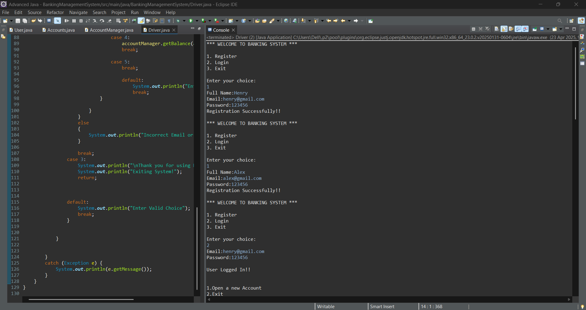
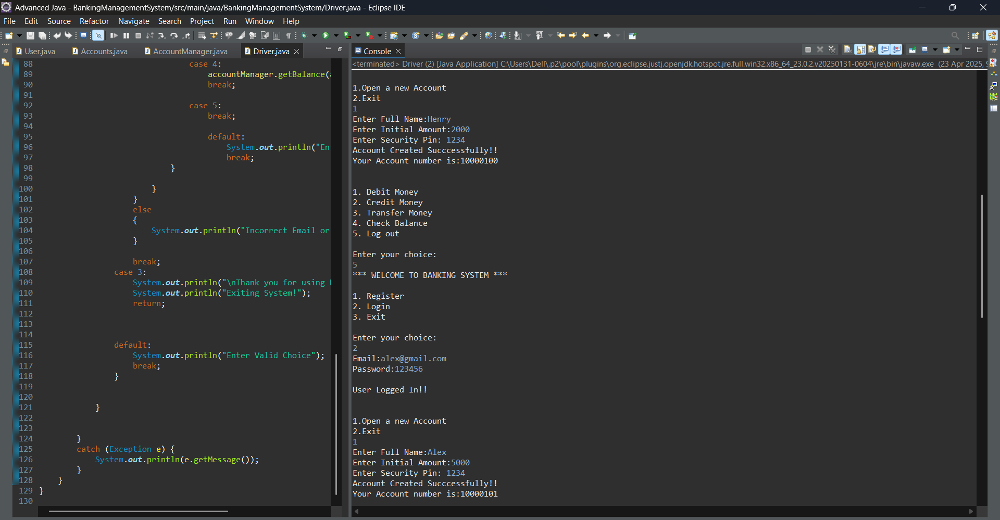

# Banking Management System

This project is a simple **Banking Management System** built using **Java** and **JDBC** that allows users to register, log in, manage accounts, and perform various banking transactions. It connects to a **MySQL** database to perform all operations securely and efficiently.

---

## 🚀 Project Description

The **Banking Management System** is a console-based application that simulates the core functionalities of a banking system. It allows users to register new accounts, authenticate securely, and perform transactions such as deposits, withdrawals, balance inquiries, and money transfers between accounts.

The system manages three main entities:
- **Users**: Handles registration, login, and credential management.
- **Accounts**: Associates each user with an account containing balance details.
- **AccountManager**: Records every deposit, withdrawal, and transfer made in the system for auditing purposes.

This project showcases the use of **Core Java concepts**, **OOP principles**, and **JDBC API** to interact with a relational database (MySQL). It’s ideal for beginners looking to practice Java database connectivity and console-based CRUD operations.

---

## ✅ Features

- 🔐 **User Registration and Login**
- 🏦 **Account Creation and Management**
- 💰 **Deposit and Withdraw Money**
- 🔄 **Transfer Money Between Accounts**
- 📊 **Check Account Balance**
- 🧾 **Transaction History (Optional Table Included)**
- 🔐 **Secure Credential Handling**
- 🖥️ **User-Friendly Console Interface**

---
## Technologies Used

- **Java** (Core Java, OOP)
- **JDBC (Java Database Connectivity)**
- **MySQL** (Relational database)

---

## Requirements

- Java JDK 8 or above
- MySQL Server
- MySQL JDBC Driver (Connector/J)

---

## Database Setup

### SQL Script

You can find the database script in the `SQL_Scripts` folder.

📁 **File:** [SQL_Scripts/setup.sql](SQL_Scripts/setup.sql)

Run this script in your MySQL Server to create necessary tables like `users`, `accounts`, `transactions`, etc.

---

## Java Files

All Java source files are located in the `Java_Files` folder:

📁 **Files**:
- [Java_Files/Driver.java](Java_Files/Driver.java)
- [Java_Files/User.java](Java_Files/User.java)
- [Java_Files/Account.java](Java_Files/Account.java)
- [Java_Files/AccountManager.java](Java_Files/AccountManager.java)


## Sample Output

Here’s a quick demo of how the system works:






---


Update the DB credentials in `Driver.java` if needed:
```java
private static final String url = "jdbc:mysql://localhost:3306/bank_db";
private static final String username = "root";
private static final String password = "root";
