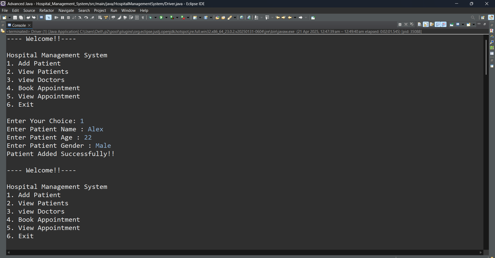

# Hospital Management System

This project is a simple **Hospital Management System** built using **Java** and **JDBC** to manage hospital data, including patient records, doctor details, and hospital departments. The system interacts with a MySQL database to perform CRUD (Create, Read, Update, Delete) operations for managing various entities.

## Features

- **Patient Management**: Allows the registration and management of patient records.
- **Doctor Management**: Allows adding, updating, and managing doctor details.
- **Department Management**: Manages hospital departments and their information.
- **Database Operations**: Demonstrates CRUD operations with MySQL database using JDBC.
- **User Interface**: Basic text-based menu system to interact with the database.

## Technologies Used

- **Java**: Core Java for backend logic and JDBC for database interaction.
- **MySQL**: For storing and managing hospital data.
- **JDBC (Java Database Connectivity)**: Used to connect Java to MySQL for executing SQL queries.

## Requirements

- Java JDK 8 or above
- MySQL Server
- MySQL JDBC Driver (Connector/J)

---

## Database Setup

### SQL Script

Run the following SQL script to set up the required database and tables:


### SQL Script

You can set up the database by running the SQL script located in the **SQL_Scripts** folder:

**File:** [SQL_Scripts/setup.sql](SQL_Scripts/setup.sql)


## Java Code

The following Java files are included in the project:

- **Driver.java**: Main program that runs the hospital management system.
- **Doctor.java**: Contains methods for managing doctors (viewing and checking doctor details).
- **Patient.java**: Contains methods for managing patient records.

The Java files are located in the **Java_Files** folder:

**Files**: 
- [Java_Files/Driver.java](Java_Files/Driver.java)
- [Java_Files/Doctor.java](Java_Files/Doctor.java)
- [Java_Files/Patient.java](Java_Files/Patient.java)


## Sample Output

Here’s a quick demo of how the system works:




---


## How to Run

1. Clone the repo or download the ZIP
2. Import the project into your IDE (like Eclipse or IntelliJ)
3. Run the `setup.sql` script in your MySQL to create the database and tables
4. Update DB credentials in `Driver.java` if needed:
   ```java
   private static final String url="jdbc:mysql://localhost:3306/hospital";
   private static final String username="root";
   private static final String password="root";

