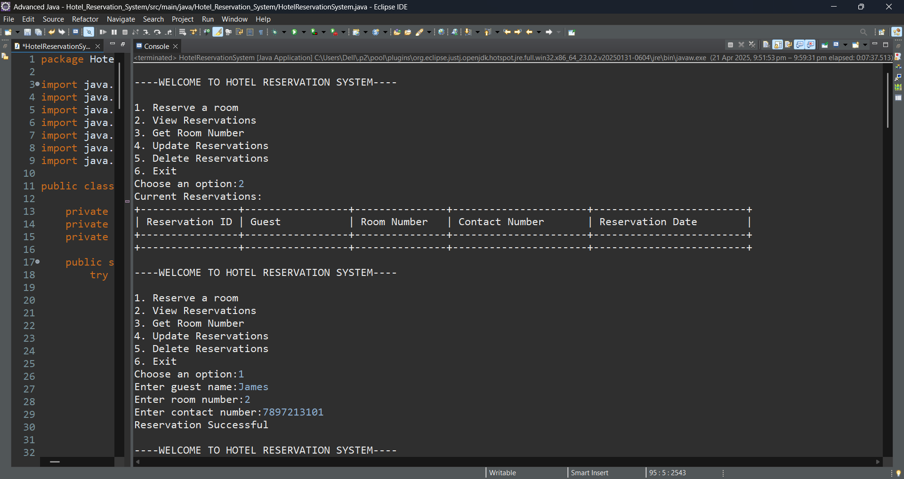
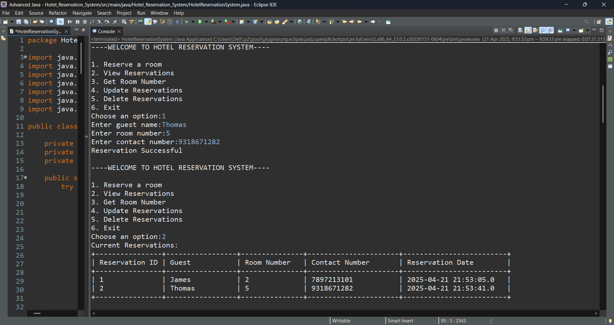
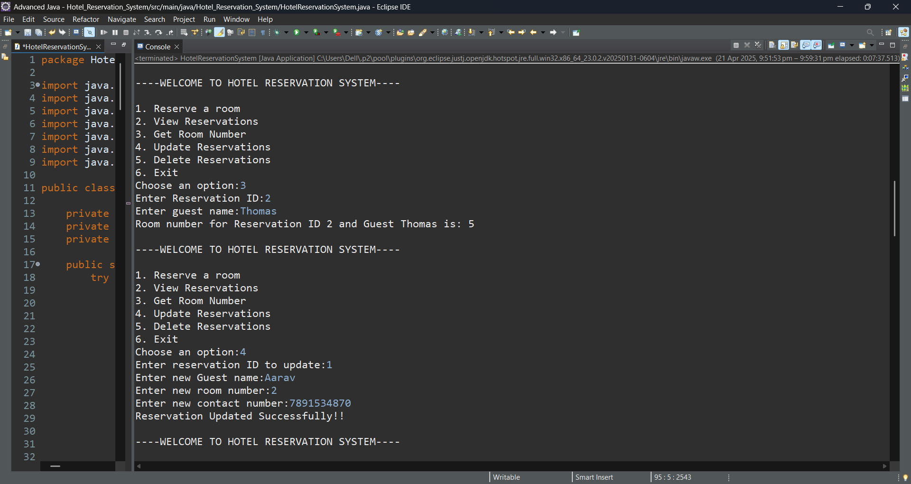

# Hotel Reservation System

This project is a simple **Hotel Reservation System** built using **Java** and **JDBC** that allows users to manage hotel bookings including room reservations, cancellations, and guest information. It connects to a **MySQL** database to perform all operations efficiently and securely.

---

## 🚀 Project Description

The **Hotel Reservation System** is a console-based Java application that simulates the functionalities of booking and managing hotel reservations. It allows guests to reserve rooms, cancel bookings, view booking history, and manage check-ins/outs.

The system manages three primary entities:
- **Guests**: Stores guest personal details.
- **Rooms**: Represents hotel rooms with availability and pricing.
- **Reservations**: Manages reservation details, check-in, check-out, and cancellation.

This project demonstrates strong understanding of **Core Java**, **JDBC**, and **MySQL database operations**. It is ideal for beginners who want to build a functional, real-world JDBC project with practical CRUD operations.

---

## ✅ Features

- 📝 **Room Booking (Reservation)**
- 🗓️ **Check-In and Check-Out Handling**
- ❌ **Cancel Reservation**
- 🔍 **Search Booking Details**
- 🏨 **Room Availability Check**
- 👤 **Guest Management**
- 🖥️ **Console-Based Interface**

---

## Technologies Used

- **Java** (Core Java, OOP)
- **JDBC (Java Database Connectivity)**
- **MySQL** (Relational database)

---

## Requirements

- Java JDK 8 or above
- MySQL Server
- MySQL JDBC Driver (Connector/J)

---

## Database Setup

### SQL Script

You can find the database script in the `SQL_Scripts` folder.

📁 **File:** [SQL_Scripts/setup.sql](SQL_Scripts/setup.sql)

Run this script in your MySQL Server to create the required tables like `guests`, `rooms`, and `reservations`.

---

## Java Files

All Java source files are located in the `Java_Files` folder:

📁 **Files**:
- [Java_Files/ReservationSystem.java](Java_Files/ReservationSystem.java)
- [Java_Files/Room.java](Java_Files/Room.java)
- [Java_Files/Guest.java](Java_Files/Guest.java)
- [Java_Files/Reservation.java](Java_Files/Reservation.java)

---

## Sample Output

Here’s a quick demo of how the system works:







---

## Database Configuration

Update the DB credentials in `ReservationSystem.java` if needed:

```java
private static final String url = "jdbc:mysql://localhost:3306/hotel_db";
private static final String username = "root";
private static final String password = "root";

