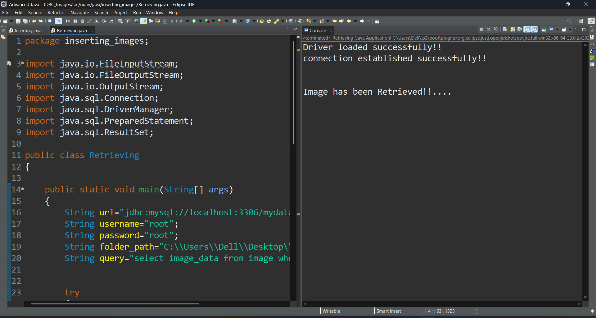

# Image Insertion and Retrieval using JDBC

This project demonstrates how to **insert and retrieve images** (stored as BLOBs) using **Java** and **MySQL** via **JDBC**.

---

## Features

- Insert an image into a MySQL table as a BLOB
- Retrieve an image from the database and save it as a file
- Handles basic file and stream operations in Java

---

## Technologies Used

- **Java** (File I/O, Streams)
- **JDBC** (Java Database Connectivity)
- **MySQL** (for storing images using BLOB type)

---

## Requirements

- Java JDK 8 or above
- MySQL Server
- MySQL JDBC Driver (Connector/J)

---

## Database Setup

📁 **File:** [SQL_Scripts/image_table.sql](SQL_Scripts/image_table.sql)

---

## Sample Output

Here’s a quick demo of how the system works:

---
