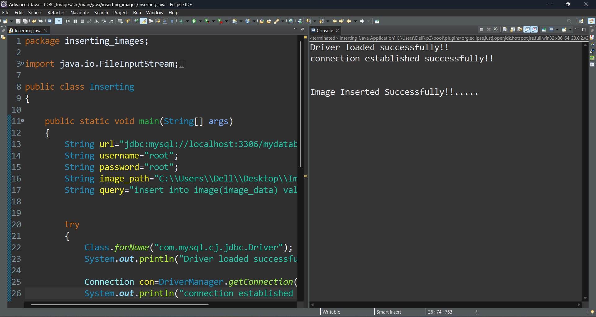

# Image Insertion and Retrieval using JDBC

This project is a simple **Java JDBC-based application** that demonstrates how to insert and retrieve image files from a **MySQL** database. It stores image data as **BLOB** (Binary Large Object) and uses **Java Streams** to handle file I/O.

---

## 🚀 Project Description

The **Image Insertion and Retrieval** project is a console-based Java application built using JDBC to show how multimedia files like images can be handled at the database level. It supports inserting an image into the database and retrieving it back to the local file system.

This mini project is useful for understanding how to:
- Work with BLOB data using JDBC
- Handle binary file I/O in Java
- Set up and interact with MySQL using JDBC

This project showcases the use of **Core Java**, **File Handling**, and **JDBC** to work with a relational database for multimedia content.

---

## ✅ Features

- 📤 **Insert image into database as BLOB**
- 📥 **Retrieve image from database and write to disk**
- 🗃️ **Simple BLOB handling with MySQL**
- 🔄 **Reusable methods for I/O stream operations**
- 📄 **Minimal and clean codebase**
- 🖥️ **Console-based interface**

---

## Technologies Used

- **Java** (File I/O, Streams, JDBC)
- **MySQL** (Database with BLOB support)
- **JDBC** (Java Database Connectivity)

---

## Requirements

- Java JDK 8 or above
- MySQL Server
- MySQL JDBC Driver (Connector/J)

---

## Database Setup

### SQL Script

You can find the database script in the `SQL_Scripts` folder.

📁 **File:** [SQL_Scripts/setup.sql](SQL_Scripts/setup.sql)

---

## Java Files

All Java source files are located in the `Java_Files` folder:

📁 **Files**:
- [Java_Files/ImageInsert.java](Java_Files/Inserting.java)
- [Java_Files/ImageRetrieve.java](Java_Files/Retrieving.java)

## Sample Output

Here’s a quick demo of how the system works:

---

